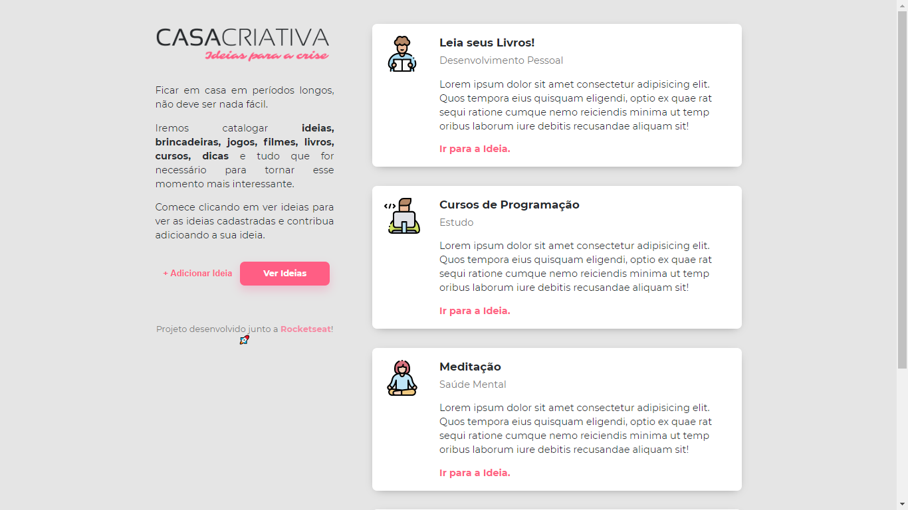
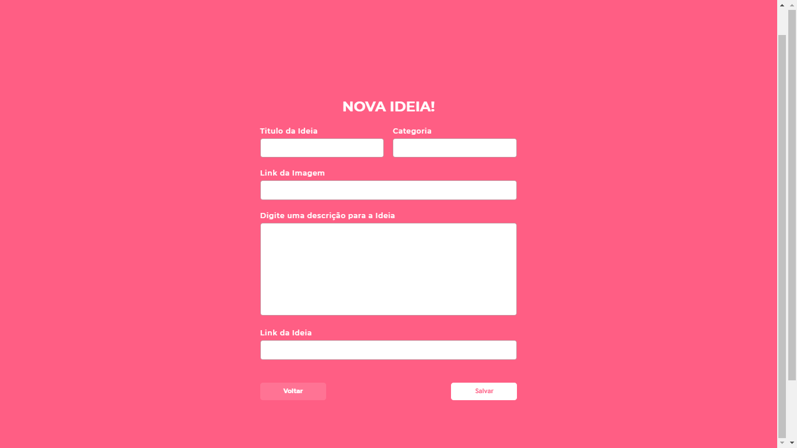
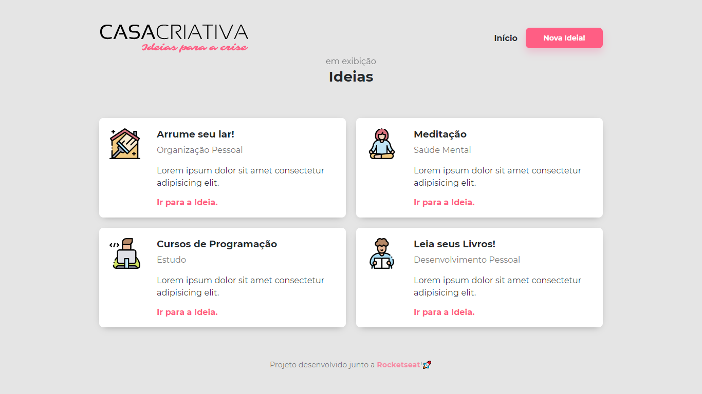

<h1 align="center">
    
</h1>

A aplicação surgiu com o objetivo de ajudar pessoas a poderem ter onde guardar suas ideias de uma maneira amigável e simples.

📌 Sobre o Casa Criativa - Ideias para a crise
------------------

🔧 Tecnologias utilizadas:
------------------

- JAVASCRIPT
- HTML5
- CSS3

💬 Fale comigo
------------------
[*LinkedIn*](https://www.linkedin.com/in/vgfranca)

Obrigado por chegarem até aqui! 🚀
E lavem as mãos!

------------------

Projeto orientado por Mayk Brito - RocketSeat.

